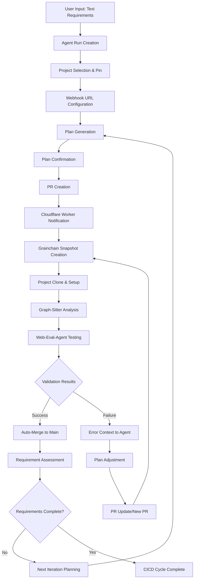

# Complete CICD Flow Definition - CodegenCICD Platform

## Overview
A fully automated CICD pipeline that transforms text requirements into deployed code through continuous validation and iteration until requirements are 100% satisfied.

## Core Flow Architecture

### 1. **Initial Requirement Input & Agent Run Creation**
```
User Input: "Create a user authentication system with JWT tokens"
↓
Agent Run Creation with:
- Requirement text analysis
- Success criteria definition
- Continuous validation loop setup
- Context tracking initialization
```

### 2. **Project Selection & Configuration**
```
Dashboard → Project Selection → Pin Project Card
↓
Automatic Configuration:
- Cloudflare Worker webhook URL setup
- GitHub repository webhook configuration
- Grainchain snapshot template preparation
- Web-eval-agent testing environment setup
```

### 3. **Plan Creation & Confirmation Workflow**
```
Codegen Agent Analysis:
- Requirement decomposition
- Technical implementation planning
- Success criteria mapping
- Risk assessment

Plan Presentation:
- Interactive plan review interface
- Step-by-step breakdown display
- User confirmation/rejection options
- Plan modification capabilities
```

### 4. **PR Creation & Notification System**
```
Agent Implementation:
- Code generation based on confirmed plan
- PR creation with detailed description
- Automatic branch management

Cloudflare Worker Notification:
- PR webhook capture
- Project card status update
- Real-time notification delivery
- Validation pipeline trigger
```

### 5. **Grainchain Snapshot Validation Pipeline**
```
Snapshot Creation:
- Custom environment with graph-sitter pre-installed
- Web-eval-agent integration
- Environment variables configuration
- Project cloning and setup

Validation Execution:
- Setup commands execution
- Graph-sitter code analysis
- Web-eval-agent UI/UX testing
- Feature completeness verification
```

### 6. **Continuous Validation & Iteration Loop**
```
Validation Results Processing:
- Success: Auto-merge to main branch
- Failure: Error context extraction
- Agent feedback with specific issues
- PR update request with corrections

Iteration Cycle:
- Agent receives error context
- Plan adjustment and re-implementation
- New PR creation or existing PR update
- Re-validation through Grainchain snapshot
```

### 7. **Requirement Satisfaction Assessment**
```
After Each Successful Implementation:
- Program state context analysis
- Requirement fulfillment evaluation
- Gap identification and documentation
- Next iteration planning (if needed)

Completion Criteria:
- All requirements fully implemented
- All tests passing
- Code quality standards met
- User acceptance validation complete
```

## Detailed Component Integration

### **Frontend Dashboard Features**
- **Project Cards**: Pin/unpin functionality with webhook URL management
- **Agent Run Interface**: Requirement input, plan review, progress tracking
- **Real-time Updates**: WebSocket connections for live status updates
- **Validation Results**: Detailed test reports and error analysis

### **Backend API Endpoints**
- **Project Management**: CRUD operations with webhook configuration
- **Agent Run Orchestration**: Creation, monitoring, and iteration management
- **Grainchain Integration**: Snapshot creation and validation execution
- **Notification System**: Real-time updates and status broadcasting

### **Cloudflare Worker Integration**
- **Webhook Gateway**: PR event capture and processing
- **Notification Routing**: Project-specific update delivery
- **Status Management**: Real-time project card updates
- **Error Handling**: Robust failure recovery and retry logic

### **Grainchain Snapshot Configuration**
```yaml
snapshot_template:
  base_image: "ubuntu:22.04"
  pre_installed_tools:
    - graph-sitter
    - web-eval-agent
    - playwright
    - node.js
    - python3
    - git
  environment_variables:
    - GEMINI_API_KEY
    - CODEGEN_API_TOKEN
    - GITHUB_TOKEN
    - PROJECT_SETUP_COMMANDS
  validation_pipeline:
    - clone_project
    - execute_setup_commands
    - run_graph_sitter_analysis
    - execute_web_eval_agent_tests
    - generate_validation_report
```

### **Web-Eval-Agent Testing Scenarios**
1. **UI Component Validation**: Form interactions, navigation, responsive design
2. **Feature Completeness**: End-to-end user workflows
3. **Performance Testing**: Load times, responsiveness, resource usage
4. **Integration Testing**: API calls, data persistence, error handling
5. **Accessibility Validation**: Screen reader compatibility, keyboard navigation

## Complete CICD Cycle Flow



## Success Metrics & KPIs

### **Performance Targets**
- **Plan Generation**: < 30 seconds
- **PR Creation**: < 2 minutes
- **Validation Pipeline**: < 10 minutes
- **Error Feedback Loop**: < 5 minutes
- **Overall Cycle Time**: < 30 minutes per iteration

### **Quality Gates**
- **Code Coverage**: > 90%
- **Graph-Sitter Analysis**: Zero critical issues
- **Web-Eval-Agent Tests**: 100% pass rate
- **Performance Benchmarks**: All targets met
- **Security Validation**: No vulnerabilities detected

### **User Experience Metrics**
- **Requirement Satisfaction**: 100% completion rate
- **Iteration Efficiency**: < 3 cycles average
- **Error Resolution**: < 24 hours
- **User Feedback**: > 4.5/5 satisfaction score

## Implementation Priority

### **Phase 1: Core Pipeline** (Weeks 1-2)
- Agent run creation and management
- Basic plan generation and confirmation
- PR creation and webhook integration

### **Phase 2: Validation Infrastructure** (Weeks 3-4)
- Grainchain snapshot integration
- Graph-sitter analysis pipeline
- Web-eval-agent testing framework

### **Phase 3: Continuous Iteration** (Weeks 5-6)
- Error feedback and context extraction
- Automatic plan adjustment
- Requirement satisfaction assessment

### **Phase 4: Optimization & Scaling** (Weeks 7-8)
- Performance optimization
- Parallel validation processing
- Advanced error recovery mechanisms

## Risk Mitigation

### **Technical Risks**
- **Snapshot Creation Failures**: Fallback to local validation
- **API Rate Limiting**: Intelligent retry with exponential backoff
- **Network Connectivity**: Offline mode with sync capabilities
- **Resource Constraints**: Dynamic scaling and load balancing

### **Process Risks**
- **Infinite Iteration Loops**: Maximum iteration limits with escalation
- **Plan Quality Issues**: Human review checkpoints
- **Validation False Positives**: Multi-stage validation with manual override
- **User Experience Degradation**: Real-time monitoring and alerting

This comprehensive CICD flow ensures that every text requirement input results in a fully validated, production-ready implementation through continuous iteration and validation until 100% requirement satisfaction is achieved.
