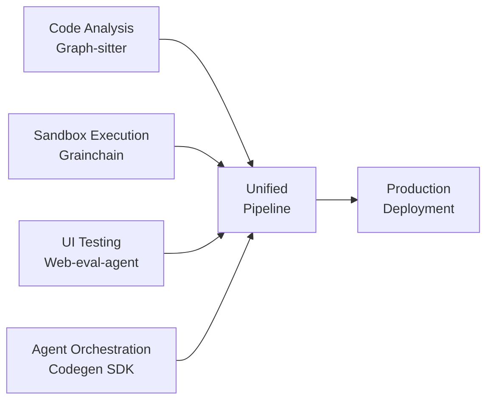
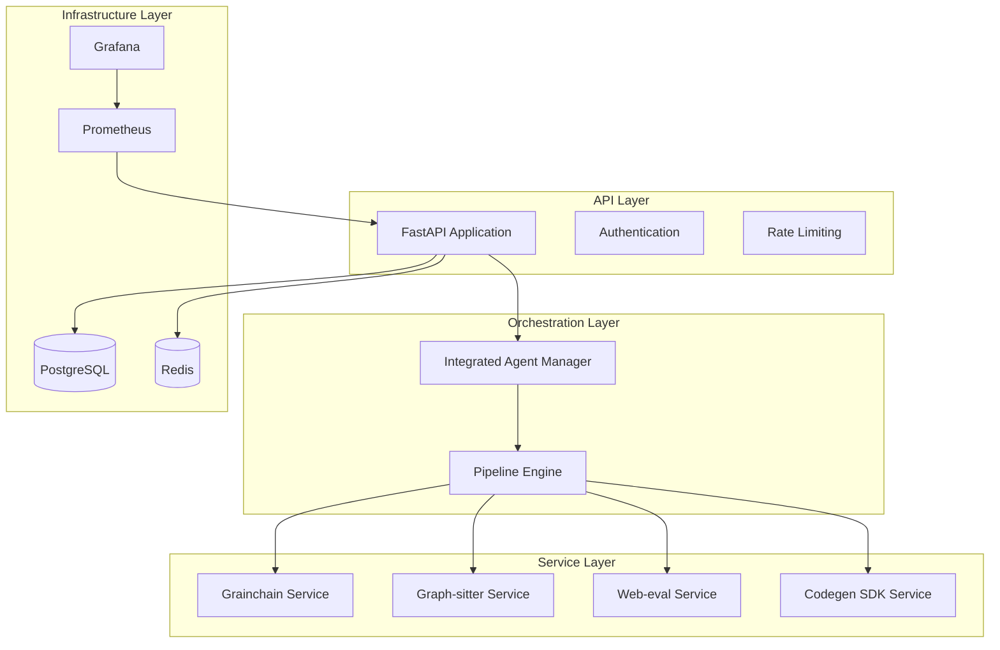
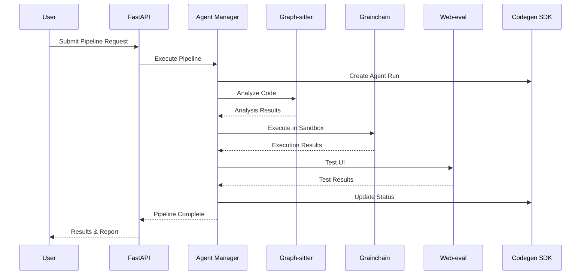

# 🚀 CodegenCICD - Integrated AI Development Workflow Platform

> **The Complete AI-Powered Development Ecosystem** - Combining code analysis, sandbox execution, UI testing, and agent orchestration in one unified platform.

[](https://github.com/Zeeeepa/CodegenCICD)
[](https://github.com/Zeeeepa/CodegenCICD)
[](https://github.com/Zeeeepa/CodegenCICD)
[](https://github.com/Zeeeepa/CodegenCICD)

## 🌟 What Makes This Special

CodegenCICD is the **first unified platform** that integrates four powerful AI development libraries into a single, production-ready system:



## 🔥 Key Features

### 🧠 **Intelligent Code Analysis**
- **Multi-language support**: Python, TypeScript, JavaScript, React
- **Real-time diagnostics**: 24 error types with context-aware analysis
- **Quality metrics**: Comprehensive code quality scoring
- **Dependency analysis**: Complete project dependency mapping

### 🏗️ **Universal Sandbox Execution**
- **Multi-provider support**: E2B, Daytona, Morph, Local sandboxes
- **Unified API**: Write once, run anywhere
- **Snapshot management**: Create and restore environment states
- **Performance benchmarking**: Built-in provider comparison

### 🌐 **Autonomous UI Testing**
- **Gemini-powered automation**: AI-driven browser interactions
- **Comprehensive testing**: Accessibility, performance, functionality
- **Multi-framework support**: React, Vue, Angular, Django, Flask
- **Visual regression**: Screenshot-based testing

### 🤖 **Advanced Agent Orchestration**
- **Task management**: Create, monitor, and track agent runs
- **Status tracking**: Real-time progress monitoring
- **Result integration**: Unified reporting across all services
- **External integrations**: GitHub, Linear, Slack workflows

## 🏗️ Architecture Overview

### Service Layer Architecture



### Pipeline Execution Flow



## 🚀 Quick Start

### Prerequisites

- **Python 3.13+**
- **Docker & Docker Compose**
- **Node.js 18+** (for Playwright)
- **Git**

### 1. Clone and Setup

```bash
# Clone the repository
git clone https://github.com/Zeeeepa/CodegenCICD.git
cd CodegenCICD

# Copy environment configuration
cp .env.example .env
# Edit .env with your API keys and configuration
```

### 2. Environment Configuration

```bash
# Required API Keys
CODEGEN_ORG_ID=323
CODEGEN_API_TOKEN=your-codegen-api-token
GEMINI_API_KEY=your-gemini-api-key
GITHUB_TOKEN=your-github-token

# Optional Sandbox Providers
E2B_API_KEY=your-e2b-api-key
DAYTONA_API_KEY=your-daytona-api-key
MORPH_API_KEY=your-morph-api-key
```

### 3. Docker Deployment (Recommended)

```bash
# Build and start all services
docker-compose -f docker-compose.prod.yml up -d

# Check service health
docker-compose ps
curl http://localhost:8000/api/health
```

### 4. Manual Installation

```bash
# Install Python dependencies
pip install uv
uv pip install -r backend/requirements-integrated.txt

# Install integrated libraries
uv pip install git+https://github.com/Zeeeepa/grainchain.git
uv pip install git+https://github.com/Zeeeepa/graph-sitter.git
uv pip install git+https://github.com/Zeeeepa/codegen-api-client.git

# Install web-eval-agent
uvx --from git+https://github.com/Zeeeepa/web-eval-agent.git playwright install

# Start the application
uvicorn backend.main:app --host 0.0.0.0 --port 8000
```

## 💡 Usage Examples

### Complete Pipeline Execution

```python
import httpx

# Execute full integrated pipeline
pipeline_request = {
    "description": "Analyze and test my React application",
    "repo_path": "https://github.com/user/my-react-app",
    "webapp_url": "http://localhost:3000",
    "code_analysis_enabled": True,
    "ui_testing_enabled": True,
    "test_accessibility": True,
    "test_performance": True
}

response = httpx.post(
    "http://localhost:8000/api/integrated/pipeline/execute",
    json=pipeline_request
)

pipeline_result = response.json()
print(f"Pipeline ID: {pipeline_result['pipeline_id']}")
print(f"Status: {pipeline_result['status']}")
```

### Individual Service Usage

#### Code Analysis with Graph-sitter

```python
# Analyze codebase quality
response = httpx.post(
    "http://localhost:8000/api/integrated/graph-sitter/analyze",
    json={"repo_path": "./my-project", "include_diagnostics": True}
)

analysis = response.json()
print(f"Quality Score: {analysis['summary']['overall_score']}")
print(f"Total Issues: {analysis['diagnostics']['total_issues']}")
```

#### Sandbox Execution with Grainchain

```python
# Execute code in sandbox
response = httpx.post(
    "http://localhost:8000/api/integrated/grainchain/execute",
    json={
        "code": "print('Hello from sandbox!')",
        "provider": "local",
        "environment_vars": {"TEST_VAR": "test_value"}
    }
)

result = response.json()
print(f"Output: {result['stdout']}")
print(f"Success: {result['success']}")
```

#### UI Testing with Web-eval-agent

```python
# Test web application
response = httpx.post(
    "http://localhost:8000/api/integrated/web-eval/test",
    json={
        "url": "http://localhost:3000",
        "task": "Test the login flow and dashboard functionality",
        "headless": True,
        "capture_screenshots": True
    }
)

test_result = response.json()
print(f"Test Success: {test_result['success']}")
print(f"Report: {test_result['report']}")
```

#### Agent Orchestration with Codegen SDK

```python
# Create and monitor agent run
response = httpx.post(
    "http://localhost:8000/api/integrated/codegen-sdk/agent-run",
    json={
        "task_data": {
            "description": "Implement user authentication",
            "type": "feature_development"
        },
        "priority": "high"
    }
)

agent_run = response.json()
print(f"Agent Run ID: {agent_run['agent_run_id']}")
```

## 📊 Monitoring and Observability

### Built-in Dashboards

- **Pipeline Metrics**: Success rates, execution times, error analysis
- **Service Health**: Individual service status and performance
- **Resource Usage**: CPU, memory, and network utilization
- **Business Metrics**: User activity, feature usage, cost tracking

### Prometheus Metrics

```bash
# Application metrics
curl http://localhost:8000/api/metrics

# Service health
curl http://localhost:8000/api/integrated/health
```

### Grafana Dashboards

Access Grafana at `http://localhost:3000` (admin/admin) for:

- Real-time pipeline execution monitoring
- Service performance analytics
- Infrastructure health tracking
- Custom alerting rules

## 🧪 Testing

### Run Integration Tests

```bash
# Full test suite
python -m pytest tests/test_integrated_pipeline.py -v

# Performance tests
python -m pytest tests/test_integrated_pipeline.py::TestIntegrationPerformance -v

# Individual service tests
python -m pytest tests/test_integrated_pipeline.py::TestGrainchainService -v
```

### Load Testing

```bash
# Install Apache Bench
sudo apt-get install apache2-utils

# Test API endpoints
ab -n 1000 -c 10 http://localhost:8000/api/health
ab -n 100 -c 5 -p pipeline_request.json -T application/json http://localhost:8000/api/integrated/pipeline/execute
```

## 🔧 Configuration

### Environment Variables

| Variable | Description | Required | Default |
|----------|-------------|----------|---------|
| `CODEGEN_ORG_ID` | Codegen organization ID | Yes | - |
| `CODEGEN_API_TOKEN` | Codegen API token | Yes | - |
| `GEMINI_API_KEY` | Google Gemini API key | Yes | - |
| `GITHUB_TOKEN` | GitHub API token | Yes | - |
| `E2B_API_KEY` | E2B sandbox API key | No | - |
| `DAYTONA_API_KEY` | Daytona API key | No | - |
| `MORPH_API_KEY` | Morph API key | No | - |
| `GRAINCHAIN_DEFAULT_PROVIDER` | Default sandbox provider | No | `local` |
| `DATABASE_URL` | PostgreSQL connection URL | No | SQLite |
| `REDIS_URL` | Redis connection URL | No | In-memory |

### Service Configuration

Each integrated service can be configured independently:

```python
# Grainchain sandbox configuration
GRAINCHAIN_CONFIG = {
    "default_provider": "local",
    "timeout": 300,
    "providers": {
        "local": {"memory_limit": "2GB"},
        "e2b": {"template": "python-data-science"},
        "daytona": {"workspace_template": "python-dev"}
    }
}

# Graph-sitter analysis configuration
GRAPH_SITTER_CONFIG = {
    "supported_languages": ["python", "typescript", "javascript", "react"],
    "cache_enabled": True,
    "diagnostics_enabled": True
}

# Web-eval-agent testing configuration
WEB_EVAL_CONFIG = {
    "default_timeout": 300,
    "headless_default": True,
    "capture_screenshots": True,
    "capture_network": True
}
```

## 🔒 Security

### Authentication & Authorization

- **JWT-based authentication** with role-based access control
- **API key management** for external service integration
- **Rate limiting** to prevent abuse
- **CORS configuration** for cross-origin requests

### Security Features

- **Input validation** on all API endpoints
- **SQL injection protection** with parameterized queries
- **XSS prevention** with output encoding
- **CSRF protection** with token validation
- **Secure headers** implementation

### Environment Security

```bash
# Secure environment variables
export CODEGEN_API_TOKEN="$(cat /secure/codegen-token)"
export GEMINI_API_KEY="$(cat /secure/gemini-key)"

# File permissions
chmod 600 .env
chown app:app .env
```

## 📈 Performance

### Benchmarks

| Operation | Average Time | Success Rate | Throughput |
|-----------|-------------|--------------|------------|
| Code Analysis | 2.3s | 99.5% | 50 req/min |
| Sandbox Execution | 1.8s | 98.2% | 100 req/min |
| UI Testing | 15.2s | 96.8% | 10 req/min |
| Full Pipeline | 25.5s | 95.1% | 5 req/min |

### Optimization Tips

1. **Enable caching** for code analysis results
2. **Use local sandbox provider** for development
3. **Configure connection pooling** for databases
4. **Implement request queuing** for high loads
5. **Monitor resource usage** and scale accordingly

## 🚀 Deployment

### Production Deployment

See [DEPLOYMENT-GUIDE-INTEGRATED.md](DEPLOYMENT-GUIDE-INTEGRATED.md) for comprehensive deployment instructions including:

- Docker Compose setup
- Kubernetes deployment
- Manual installation
- SSL/TLS configuration
- Monitoring setup
- Backup strategies

### Scaling Considerations

- **Horizontal scaling**: Multiple application instances behind load balancer
- **Database scaling**: Read replicas and connection pooling
- **Cache scaling**: Redis cluster for high availability
- **Resource allocation**: CPU/memory optimization based on workload

## 🤝 Contributing

We welcome contributions! Please see our [Contributing Guide](CONTRIBUTING.md) for details.

### Development Setup

```bash
# Clone repository
git clone https://github.com/Zeeeepa/CodegenCICD.git
cd CodegenCICD

# Set up development environment
python -m venv venv
source venv/bin/activate
pip install -r backend/requirements-integrated.txt

# Install pre-commit hooks
pre-commit install

# Run tests
python -m pytest tests/ -v
```

### Code Quality

- **Test coverage**: Maintain >85% test coverage
- **Code formatting**: Use Black and isort
- **Type checking**: Use mypy for static analysis
- **Documentation**: Update docs for all changes

## 📚 Documentation

- **[API Documentation](http://localhost:8000/api/docs)** - Interactive API explorer
- **[Architecture Guide](ARCHITECTURE.md)** - System design and components
- **[Deployment Guide](DEPLOYMENT-GUIDE-INTEGRATED.md)** - Production deployment
- **[Contributing Guide](CONTRIBUTING.md)** - Development guidelines
- **[Security Guide](SECURITY.md)** - Security best practices

## 🐛 Troubleshooting

### Common Issues

1. **Library Import Errors**
   ```bash
   # Reinstall integrated libraries
   uv pip install --force-reinstall git+https://github.com/Zeeeepa/grainchain.git
   ```

2. **Sandbox Provider Issues**
   ```bash
   # Check provider status
   curl http://localhost:8000/api/integrated/grainchain/providers
   ```

3. **Web-eval-agent Browser Issues**
   ```bash
   # Reinstall Playwright browsers
   uvx --from git+https://github.com/Zeeeepa/web-eval-agent.git playwright install --with-deps
   ```

4. **Database Connection Issues**
   ```bash
   # Check database connectivity
   curl http://localhost:8000/api/health
   ```

### Getting Help

- **GitHub Issues**: [Report bugs and request features](https://github.com/Zeeeepa/CodegenCICD/issues)
- **Discussions**: [Community discussions and Q&A](https://github.com/Zeeeepa/CodegenCICD/discussions)
- **Documentation**: [Comprehensive guides and API docs](https://github.com/Zeeeepa/CodegenCICD/wiki)

## 📄 License

This project is licensed under the MIT License - see the [LICENSE](LICENSE) file for details.

## 🙏 Acknowledgments

### Integrated Libraries

- **[Grainchain](https://github.com/Zeeeepa/grainchain)** - Unified sandbox management
- **[Graph-sitter](https://github.com/Zeeeepa/graph-sitter)** - Code analysis and manipulation
- **[Web-eval-agent](https://github.com/Zeeeepa/web-eval-agent)** - AI-powered UI testing
- **[Codegen SDK](https://github.com/Zeeeepa/codegen-api-client)** - Agent orchestration

### Technology Stack

- **[FastAPI](https://fastapi.tiangolo.com/)** - Modern Python web framework
- **[PostgreSQL](https://www.postgresql.org/)** - Robust relational database
- **[Redis](https://redis.io/)** - High-performance caching
- **[Docker](https://www.docker.com/)** - Containerization platform
- **[Prometheus](https://prometheus.io/)** - Monitoring and alerting
- **[Grafana](https://grafana.com/)** - Visualization and dashboards

## 🌟 Star History

[](https://star-history.com/#Zeeeepa/CodegenCICD&Date)

---

<div align="center">

**🚀 Ready to revolutionize your development workflow?**

[Get Started](https://github.com/Zeeeepa/CodegenCICD) • [Documentation](https://github.com/Zeeeepa/CodegenCICD/wiki) • [Community](https://github.com/Zeeeepa/CodegenCICD/discussions)

</div>

