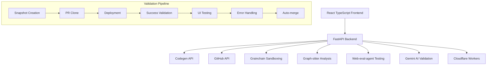

# 🚀 CodegenCICD Dashboard

**AI-Powered CI/CD Management System with Intelligent Validation Pipeline**

[](https://python.org)
[](https://reactjs.org)
[](https://typescriptlang.org)
[](https://fastapi.tiangolo.com)
[](LICENSE)

## 🌟 **Overview**

CodegenCICD Dashboard is a comprehensive AI-powered CI/CD management system that transforms natural language requirements into production-ready code through an intelligent validation pipeline. Built with modern web technologies and integrated with cutting-edge AI services.

### **🎯 Key Features**

✅ **AI-Powered Development** - Natural language to code generation via Codegen API  
✅ **GitHub Integration** - Seamless repository management and PR automation  
✅ **Intelligent Validation Pipeline** - 7-step automated testing and deployment  
✅ **Real-time Dashboard** - Live project monitoring with WebSocket updates  
✅ **4-Tab Configuration System** - Repository rules, setup commands, secrets, and planning  
✅ **Auto-merge Capabilities** - Validated PRs can be automatically merged  
✅ **Multi-Service Integration** - Grainchain, Graph-sitter, Web-eval-agent, Gemini AI  

## 🏗️ **Architecture**



## 🛠️ **Technology Stack**

### **Frontend**
- **React 18** with TypeScript
- **Material-UI** for modern components
- **WebSocket** for real-time updates
- **Axios** for API communication

### **Backend**
- **FastAPI** with Python 3.8+
- **WebSocket** support for live updates
- **RESTful API** architecture
- **Async/await** for performance

### **External Integrations**
- **[Codegen API](https://docs.codegen.com/api-reference)** - AI agent coordination
- **[Grainchain](https://github.com/Zeeeepa/grainchain)** - Sandboxing and snapshots
- **[Graph-sitter](https://github.com/Zeeeepa/graph-sitter)** - Code quality analysis
- **[Web-eval-agent](https://github.com/Zeeeepa/web-eval-agent)** - UI testing and automation
- **GitHub API** - Repository management
- **Gemini AI** - Intelligent validation
- **Cloudflare Workers** - Webhook gateway

## 🚀 **Quick Start**

### **Prerequisites**

- **Python 3.8+** - [Download Python](https://python.org/downloads)
- **Node.js 16+** - [Download Node.js](https://nodejs.org)
- **Git** - [Download Git](https://git-scm.com)

### **1. Clone Repository**

```bash
git clone https://github.com/Zeeeepa/CodegenCICD.git
cd CodegenCICD
```

### **2. Install Dependencies**

```bash
./deploy.sh
```

This script will:
- ✅ Check system requirements
- ✅ Create Python virtual environment
- ✅ Install Python dependencies
- ✅ Install Node.js dependencies
- ✅ Create configuration templates
- ✅ Set up logging directories

### **3. Configure Environment**

```bash
cp .env.example .env
nano .env  # Edit with your API keys
```

**Required API Keys:**
```bash
CODEGEN_ORG_ID=your_org_id_here
CODEGEN_API_TOKEN=your_codegen_api_token_here
GITHUB_TOKEN=your_github_token_here
GEMINI_API_KEY=your_gemini_api_key_here
CLOUDFLARE_API_KEY=your_cloudflare_api_key_here
CLOUDFLARE_ACCOUNT_ID=your_cloudflare_account_id_here
CLOUDFLARE_WORKER_URL=your_cloudflare_worker_url_here
```

### **4. Launch Dashboard**

```bash
./start.sh
```

The script will:
- ✅ Validate environment variables
- ✅ Prompt for missing values
- ✅ Check port availability
- ✅ Start backend and frontend services
- ✅ Provide access URLs and monitoring info

### **5. Access Dashboard**

- **Frontend**: http://localhost:3001
- **Backend API**: http://localhost:8000
- **API Docs**: http://localhost:8000/docs

## 📋 **Usage Guide**

### **Project Management**

1. **Select Project**: Choose from GitHub repositories dropdown
2. **Configure Settings**: Use the 4-tab configuration system
3. **Run AI Agent**: Click "Agent Run" button and describe your goal
4. **Monitor Progress**: Watch real-time updates via WebSocket
5. **Review Results**: Handle regular/plan/PR responses appropriately

### **Configuration Tabs**

#### **1. Repository Rules**
Define custom rules for AI agent behavior:
```
- Follow company coding standards
- Use TypeScript for all new components
- Include comprehensive error handling
- Write unit tests for all functions
```

#### **2. Setup Commands**
Specify deployment commands:
```bash
cd backend
python -m venv venv
source venv/bin/activate
pip install -r requirements.txt
cd ../frontend
npm install
npm run build
```

#### **3. Secrets Management**
Securely store environment variables:
- Individual key-value pairs
- Bulk paste from text file
- Encrypted storage

#### **4. Planning Statements**
Configure AI agent behavior:
```
You are a senior full-stack developer specializing in React and Python.
Focus on clean, maintainable code with comprehensive error handling.
Always include proper TypeScript types and documentation.
```

### **Validation Pipeline**

The 7-step validation process:

1. **📸 Snapshot Creation** - Grainchain creates isolated environment
2. **📥 PR Codebase Clone** - Downloads PR changes
3. **🚀 Deployment Commands** - Runs setup commands
4. **✅ Success Validation** - Gemini AI validates deployment
5. **🧪 UI Testing** - Web-eval-agent tests all flows
6. **🔄 Error Handling** - Automatic retry with context
7. **🎯 Auto-merge** - Merge validated PRs (if enabled)

## 🔧 **API Reference**

### **Core Endpoints**

```http
GET    /health                 # Health check
GET    /api/projects          # List GitHub projects
POST   /api/projects/{id}/run # Start AI agent run
GET    /api/runs/{id}         # Get run status
POST   /api/runs/{id}/continue # Continue conversation
```

### **WebSocket Events**

```javascript
// Connect to WebSocket
const ws = new WebSocket('ws://localhost:8000/ws');

// Listen for updates
ws.onmessage = (event) => {
  const data = JSON.parse(event.data);
  console.log('Update:', data);
};
```

## 🔐 **Security**

- **Environment Variables** - Sensitive data stored in .env
- **API Token Validation** - Format checking for all tokens
- **CORS Configuration** - Configurable origins
- **Secret Encryption** - Encrypted storage for project secrets

## 📊 **Monitoring & Logging**

### **Log Files**
- `logs/backend.log` - Backend service logs
- `logs/frontend.log` - Frontend service logs

### **Monitoring Commands**
```bash
# View live logs
tail -f logs/backend.log logs/frontend.log

# Check service status
ps aux | grep -E "(python|node)" | grep -v grep

# Monitor ports
lsof -i :8000,3001
```

## 🛠️ **Development**

### **Backend Development**
```bash
cd backend
source venv/bin/activate
python main.py
```

### **Frontend Development**
```bash
cd frontend
npm start
```

### **Adding New Features**
1. Update backend API endpoints
2. Add frontend components
3. Update WebSocket handlers
4. Test validation pipeline
5. Update documentation

## 🔄 **Deployment**

### **Development**
```bash
./start.sh
```

### **Production**
1. Set environment variables for production
2. Configure SSL certificates
3. Set up reverse proxy (nginx)
4. Configure monitoring (Prometheus/Grafana)
5. Set up log rotation

## 🐛 **Troubleshooting**

### **Common Issues**

**Port Already in Use**
```bash
# Kill processes on ports
lsof -ti:8000,3001 | xargs kill -9
```

**Python Virtual Environment Issues**
```bash
# Recreate virtual environment
rm -rf backend/venv
cd backend
python3 -m venv venv
source venv/bin/activate
pip install -r requirements.txt
```

**Node.js Dependencies Issues**
```bash
# Clear cache and reinstall
cd frontend
rm -rf node_modules package-lock.json
npm cache clean --force
npm install
```

**API Connection Issues**
- Verify API tokens are correct
- Check network connectivity
- Validate environment variables
- Review backend logs

## 📚 **External Services Setup**

### **Codegen API**
1. Sign up at [codegen.com](https://codegen.com)
2. Get your organization ID and API token
3. Add to environment variables

### **GitHub Integration**
1. Create Personal Access Token
2. Grant repository permissions
3. Add token to environment

### **Gemini AI**
1. Get API key from Google AI Studio
2. Enable Gemini API
3. Add key to environment

### **Cloudflare Workers**
1. Set up Cloudflare account
2. Deploy webhook worker
3. Configure worker URL

## 🤝 **Contributing**

1. Fork the repository
2. Create feature branch (`git checkout -b feature/amazing-feature`)
3. Commit changes (`git commit -m 'Add amazing feature'`)
4. Push to branch (`git push origin feature/amazing-feature`)
5. Open Pull Request

## 📄 **License**

This project is licensed under the MIT License - see the [LICENSE](LICENSE) file for details.

## 🙏 **Acknowledgments**

- **[Codegen](https://codegen.com)** - AI agent platform
- **[Grainchain](https://github.com/Zeeeepa/grainchain)** - Sandboxing technology
- **[Graph-sitter](https://github.com/Zeeeepa/graph-sitter)** - Code analysis
- **[Web-eval-agent](https://github.com/Zeeeepa/web-eval-agent)** - UI testing
- **FastAPI** - Modern Python web framework
- **React** - Frontend library
- **Material-UI** - Component library

---

**🚀 Ready to transform your development workflow with AI-powered CI/CD? Get started now!**

```bash
git clone https://github.com/Zeeeepa/CodegenCICD.git
cd CodegenCICD
./deploy.sh
./start.sh
```

**Dashboard will be available at: http://localhost:3001** 🎯

