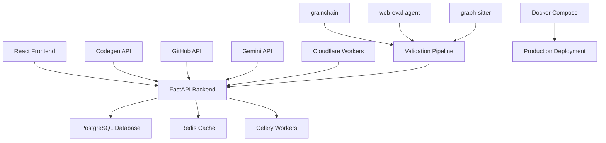

# 🚀 CodegenCICD Dashboard - Complete Unified System

**AI-Powered CI/CD Flow Cycle Project Management System**

A comprehensive dashboard for managing AI-driven development workflows using the Codegen API, featuring real-time project management, automated validation pipelines, and intelligent code analysis. This unified system combines the best features from multiple implementations into a single, production-ready solution.


## 🎯 **Overview**

CodegenCICD Dashboard is the ultimate AI-powered CI/CD management system that automates the entire development workflow from code generation to deployment validation. It integrates multiple AI services and tools to provide a seamless, intelligent development experience with **three configuration tiers** to match your needs.

### **🌟 Key Features**

✅ **Complete CI/CD Automation** - End-to-end workflow automation with AI agents  
✅ **7-Step Validation Pipeline** - Comprehensive testing with grainchain + web-eval-agent + graph-sitter  
✅ **Real-time WebSocket Updates** - Live progress tracking and notifications  
✅ **Tiered Configuration System** - Basic → Intermediate → Advanced feature sets  
✅ **4-Tab Project Configuration** - Repository rules, setup commands, secrets, planning statements  
✅ **Auto-merge Validated PRs** - Intelligent PR management and deployment  
✅ **Multi-language Code Analysis** - TypeScript, JavaScript, Python, Rust, Go support  
✅ **Production-Ready Deployment** - Docker Compose with monitoring and scaling  

## 🏗️ **Architecture**

### **System Components**



### **Configuration Tiers**

| Tier | Features | Use Case |
|------|----------|----------|
| **Basic** | Core functionality, projects, agent runs, basic validation | Development, small teams |
| **Intermediate** | WebSocket updates, background tasks, advanced validation | Staging, growing teams |
| **Advanced** | Monitoring, SSL, email notifications, enterprise security | Production, enterprise |

## 🚀 **Quick Start**

### **Prerequisites**

- Docker & Docker Compose
- Node.js 18+ (for local development)
- Python 3.11+ (for local development)

### **1. Clone Repository**

```bash
git clone https://github.com/Zeeeepa/CodegenCICD.git
cd CodegenCICD
```

### **2. Environment Setup**

```bash
# Copy environment template
cp .env.example .env

# Edit .env with your API keys and configuration
nano .env
```

**Required Configuration:**
```bash
# Configuration Tier (basic/intermediate/advanced)
CONFIG_TIER=basic

# Codegen API
CODEGEN_ORG_ID=323
CODEGEN_API_TOKEN=sk-your-codegen-api-token

# GitHub Integration
GITHUB_TOKEN=github_pat_your-github-token

# AI Services
GEMINI_API_KEY=AIzaSy-your-gemini-api-key

# Security
SECRET_KEY=your-super-secret-key-min-32-chars
ENCRYPTION_KEY=your-encryption-key-base64-32-bytes
ENCRYPTION_SALT=your-encryption-salt-unique-value

# Database
POSTGRES_PASSWORD=secure-password-change-in-production
```

### **3. Deploy with Docker**

```bash
# Basic setup (development)
docker-compose up -d

# Intermediate setup (with background workers)
docker-compose --profile intermediate up -d

# Advanced setup (with monitoring)
docker-compose --profile advanced up -d

# Production setup (with nginx)
docker-compose --profile production up -d
```

### **4. Access Dashboard**

- **Dashboard**: http://localhost:3000
- **API Docs**: http://localhost:8000/docs
- **Health Check**: http://localhost:8000/health
- **Monitoring**: http://localhost:3001 (Grafana, advanced tier)

## 🎮 **Usage Guide**

### **1. Project Management**

#### **Create Project**
1. Click "Create Project" in dashboard
2. Enter GitHub repository details
3. Configure webhook URL (auto-generated)
4. Set initial configuration

#### **4-Tab Project Configuration**

**🔧 Repository Rules Tab**
```
- Use TypeScript for all new code
- Follow existing code style conventions
- Add proper error handling and logging
- Include unit tests for new features
- Document all public APIs
```

**⚙️ Setup Commands Tab**
```bash
cd backend
python -m pip install -r requirements.txt
python manage.py migrate
cd ../frontend
npm install
npm run build
npm start
```

**🔐 Secrets Tab**
```
CODEGEN_ORG_ID=323
CODEGEN_TOKEN=sk-your-token
GITHUB_TOKEN=github_pat_your-token
GEMINI_API_KEY=your-gemini-key
DATABASE_URL=postgresql://...
```

**📋 Planning Statement Tab**
```
You are working on a React/FastAPI project. Always follow these guidelines:
- Use TypeScript for frontend components
- Follow REST API conventions
- Implement proper error handling
- Add comprehensive logging
- Ensure responsive design
- Write clean, maintainable code
```

### **2. AI Agent Workflow**

#### **Starting an Agent Run**
1. Select project from dropdown header
2. Click "Agent Run" button on project card
3. Enter target/goal in natural language
4. Planning statement automatically prepended
5. Real-time progress tracking via WebSocket

#### **Response Types**

**📝 Regular Response**
- Shows agent output
- "Continue" button for additional input
- Resume endpoint integration

**📋 Plan Response**
- Displays proposed plan with steps
- "Confirm" or "Modify" buttons
- Auto-confirm option available

**🔄 PR Response**
- Shows created PR link with number
- Triggers automatic validation pipeline
- Real-time validation progress updates

### **3. Complete 7-Step Validation Pipeline**

When a PR is created, the system automatically runs:

#### **Step 1: Snapshot Creation**
- Creates grainchain sandbox environment
- Deploys web-eval-agent + graph-sitter
- Configures required environment variables

#### **Step 2: Code Clone**
- Clones PR branch to sandbox
- Validates repository access
- Prepares isolated workspace

#### **Step 3: Code Analysis**
- Runs graph-sitter analysis
- Checks code quality metrics
- Supports TypeScript, JavaScript, Python, Rust, Go

#### **Step 4: Deployment**
- Executes project setup commands
- Applies environment variables
- Real-time deployment logs

#### **Step 5: Deployment Validation**
- Uses Gemini API for intelligent validation
- Analyzes deployment success/failure
- Provides confidence scoring

#### **Step 6: UI Testing**
- Runs comprehensive web-eval-agent tests
- Tests all flows and components
- Generates detailed test reports

#### **Step 7: Auto-merge**
- Checks auto-merge settings and score thresholds
- Merges PR if validation passes
- Sends completion notifications

### **4. Error Handling & Recovery**

#### **Automatic Error Recovery**
- Failed steps trigger intelligent retry mechanism
- Error context automatically sent to Codegen API
- Automatic PR updates with fixes
- Maximum 3 retries per step with exponential backoff

#### **Error Context Integration**
- Deployment errors → Gemini analysis → Codegen fix
- UI test failures → web-eval-agent logs → Codegen fix
- Real-time error reporting via WebSocket
- Comprehensive error logging and tracking

## 🔧 **Configuration**

### **Tiered Configuration System**

The system supports three configuration tiers that automatically enable/disable features:

#### **Basic Tier** (Default)
```bash
CONFIG_TIER=basic
```
**Features:**
- ✅ Projects and agent runs
- ✅ Basic validation pipeline
- ✅ GitHub integration
- ✅ Codegen API integration
- ✅ Core dashboard functionality

#### **Intermediate Tier**
```bash
CONFIG_TIER=intermediate
```
**Additional Features:**
- ✅ Real-time WebSocket updates
- ✅ Background task processing (Celery)
- ✅ Rate limiting and security
- ✅ Advanced validation pipeline
- ✅ Comprehensive error handling

#### **Advanced Tier** (Enterprise)
```bash
CONFIG_TIER=advanced
```
**Additional Features:**
- ✅ Prometheus monitoring + Grafana dashboards
- ✅ SSL/TLS support
- ✅ Email notifications
- ✅ Enterprise security features
- ✅ Database backup and recovery
- ✅ Advanced logging and analytics

### **Environment Variables**

**Core Configuration:**
```bash
# Application
CONFIG_TIER=basic|intermediate|advanced
ENVIRONMENT=development|staging|production
DEBUG=true|false
LOG_LEVEL=DEBUG|INFO|WARNING|ERROR

# Database
POSTGRES_PASSWORD=secure-password
DATABASE_URL=postgresql+asyncpg://...
REDIS_URL=redis://localhost:6379/0

# Security
SECRET_KEY=your-secret-key-min-32-chars
ENCRYPTION_KEY=base64-encoded-32-bytes
ENCRYPTION_SALT=unique-salt-value
```

**API Integration:**
```bash
# Codegen API
CODEGEN_ORG_ID=323
CODEGEN_API_TOKEN=sk-your-token

# GitHub
GITHUB_TOKEN=github_pat_your-token
GITHUB_WEBHOOK_SECRET=webhook-secret

# AI Services
GEMINI_API_KEY=your-gemini-key

# Cloudflare
CLOUDFLARE_API_KEY=your-api-key
CLOUDFLARE_ACCOUNT_ID=your-account-id
CLOUDFLARE_WORKER_URL=https://your-worker.workers.dev
```

**Validation Tools:**
```bash
# Grainchain (sandboxing)
GRAINCHAIN_ENABLED=true
GRAINCHAIN_DOCKER_SOCKET=/var/run/docker.sock
GRAINCHAIN_WORKSPACE_DIR=/tmp/grainchain_workspaces

# Web-eval-agent (UI testing)
WEB_EVAL_ENABLED=true
WEB_EVAL_BROWSER=chromium
WEB_EVAL_HEADLESS=true
WEB_EVAL_TIMEOUT=30000

# Graph-sitter (code quality)
GRAPH_SITTER_ENABLED=true
GRAPH_SITTER_LANGUAGES=typescript,javascript,python,rust,go
```

## 🐳 **Deployment**

### **Development Deployment**

```bash
# Start all services
docker-compose up -d

# View logs
docker-compose logs -f backend

# Stop services
docker-compose down
```

### **Staging Deployment**

```bash
# Intermediate tier with background workers
docker-compose --profile intermediate up -d

# Scale workers
docker-compose up -d --scale celery_worker=4
```

### **Production Deployment**

```bash
# Advanced tier with monitoring and SSL
docker-compose --profile production --profile advanced up -d

# Health check
curl https://your-domain.com/health
```

### **Scaling & Performance**

```bash
# Scale backend services
docker-compose up -d --scale backend=3

# Scale validation workers
docker-compose up -d --scale celery_worker=8

# Monitor performance
docker-compose logs -f prometheus
```

## 📊 **Monitoring & Analytics**

### **Health Checks**

All services include comprehensive health checks:

- **Backend**: `/health` endpoint with database connectivity
- **Database**: PostgreSQL connection and query tests
- **Redis**: Ping command and memory usage
- **Frontend**: HTTP response and asset loading

### **Metrics & Dashboards** (Advanced Tier)

#### **Prometheus Metrics**
- API request rates and latencies
- Validation pipeline success rates
- Database connection pool status
- WebSocket connection counts
- Agent run completion rates

#### **Grafana Dashboards**
- Real-time system metrics
- Validation pipeline analytics
- Error rate monitoring
- Performance tracking
- User activity analytics

### **Logging**

```bash
# View all logs
docker-compose logs -f

# Service-specific logs
docker-compose logs -f backend
docker-compose logs -f celery_worker

# Validation pipeline logs
docker-compose logs -f backend | grep validation

# Error logs only
docker-compose logs -f backend | grep ERROR
```

## 🔒 **Security**

### **Data Protection**

#### **Encryption**
- Secrets encrypted with Fernet (AES 128)
- PBKDF2 key derivation with salt
- Base64 encoding for secure storage

#### **Authentication**
- JWT-based API authentication
- API key support for service integration
- Environment-based configuration

#### **Network Security**
- Docker network isolation
- CORS configuration with origin validation
- Rate limiting on API endpoints
- SSL/TLS support (advanced tier)

### **Best Practices**

#### **Environment Variables**
- Never commit `.env` files to version control
- Use strong, unique passwords (min 32 characters)
- Rotate API keys regularly
- Use different secrets for each environment

#### **Database Security**
- Encrypted connections with SSL
- Regular automated backups
- Access control with least privilege
- Connection pooling with limits

## 🧪 **Testing**

### **Running Tests**

```bash
# Backend tests
cd backend
python -m pytest tests/ -v --cov=backend

# Frontend tests
cd frontend
npm test -- --coverage

# Integration tests
docker-compose -f docker-compose.test.yml up --abort-on-container-exit

# End-to-end tests
python tests/test_complete_flow.py
```

### **Test Coverage**

The system includes comprehensive testing:

- **Unit Tests**: Individual component testing
- **Integration Tests**: Service interaction testing
- **API Tests**: Complete API endpoint testing
- **E2E Tests**: Full workflow testing with web-eval-agent
- **Performance Tests**: Load and stress testing

## 📚 **API Documentation**

### **REST API Endpoints**

#### **Projects**
- `GET /api/v1/projects` - List all projects
- `POST /api/v1/projects` - Create new project
- `GET /api/v1/projects/{id}` - Get project details
- `PUT /api/v1/projects/{id}` - Update project
- `DELETE /api/v1/projects/{id}` - Delete project

#### **Agent Runs**
- `POST /api/v1/agent-runs` - Start agent run
- `GET /api/v1/agent-runs/{id}` - Get agent run status
- `POST /api/v1/agent-runs/{id}/continue` - Continue agent run

#### **Validation**
- `POST /api/v1/validation/start` - Start validation pipeline
- `GET /api/v1/validation/{id}` - Get validation status
- `GET /api/v1/validation/{id}/logs` - Get validation logs

#### **Configuration**
- `GET /api/v1/configurations/{project_id}` - Get project configuration
- `PUT /api/v1/configurations/{project_id}` - Update configuration
- `POST /api/v1/configurations/{project_id}/secrets` - Create secret

#### **Webhooks**
- `POST /api/v1/webhooks/github` - GitHub webhook handler

### **WebSocket Events** (Intermediate+ Tier)

#### **Client → Server**
```javascript
// Subscribe to project updates
{
  "type": "subscribe_project",
  "project_id": "uuid"
}

// Heartbeat
{
  "type": "ping",
  "timestamp": "2024-01-01T00:00:00Z"
}
```

#### **Server → Client**
```javascript
// Agent run update
{
  "type": "agent_run_update",
  "project_id": "uuid",
  "agent_run_id": "uuid",
  "status": "running",
  "data": {...}
}

// Validation update
{
  "type": "validation_update",
  "project_id": "uuid",
  "step_index": 2,
  "step": {...},
  "overall_status": "running"
}

// PR notification
{
  "type": "pr_notification",
  "project_id": "uuid",
  "pr_url": "https://github.com/user/repo/pull/123",
  "action": "created"
}
```

## 🛠️ **Development**

### **Local Development Setup**

```bash
# Clone repository
git clone https://github.com/Zeeeepa/CodegenCICD.git
cd CodegenCICD

# Backend setup
cd backend
python -m venv venv
source venv/bin/activate  # Windows: venv\Scripts\activate
pip install -r requirements.txt

# Frontend setup
cd ../frontend
npm install
npm start

# Database setup
docker-compose up -d postgres redis
python backend/database.py  # Create tables
```

### **Code Style**

#### **Backend (Python)**
- Black code formatting
- isort import sorting
- flake8 linting
- Type hints required
- Structured logging with structlog

#### **Frontend (TypeScript)**
- Prettier code formatting
- ESLint linting
- Strict TypeScript configuration
- Material-UI design system

### **Contributing**

1. Fork the repository
2. Create feature branch (`git checkout -b feature/amazing-feature`)
3. Make changes with tests
4. Run linting and tests
5. Submit pull request
6. Code review process
7. Merge after approval

## 🔧 **Troubleshooting**

### **Common Issues**

#### **Database Connection Errors**
```bash
# Check PostgreSQL status
docker-compose ps postgres

# View database logs
docker-compose logs postgres

# Reset database
docker-compose down -v
docker-compose up -d postgres
```

#### **WebSocket Connection Issues**
```bash
# Check backend logs
docker-compose logs backend | grep websocket

# Test WebSocket endpoint
wscat -c ws://localhost:8000/ws/test-client
```

#### **Validation Pipeline Failures**
```bash
# Check validation logs
docker-compose logs backend | grep validation

# Check grainchain integration
docker ps | grep grainchain

# Check web-eval-agent status
docker-compose logs celery_worker | grep web-eval
```

### **Performance Optimization**

#### **Database Optimization**
- Add indexes for frequently queried fields
- Use connection pooling
- Regular VACUUM and ANALYZE
- Monitor slow queries

#### **Redis Optimization**
- Configure memory limits
- Use appropriate data structures
- Monitor memory usage
- Set up Redis clustering for scale

#### **Frontend Optimization**
- Enable code splitting
- Optimize bundle size
- Use service workers for caching
- Implement lazy loading

## 🤝 **Contributing**

We welcome contributions! Please see our [Contributing Guide](CONTRIBUTING.md) for details.

### **Development Process**

1. **Fork & Clone**: Fork the repo and clone locally
2. **Branch**: Create a feature branch
3. **Develop**: Make changes with tests
4. **Test**: Run full test suite
5. **Document**: Update documentation
6. **Submit**: Create pull request
7. **Review**: Address feedback
8. **Merge**: Celebrate! 🎉

## 📄 **License**

This project is licensed under the MIT License - see the [LICENSE](LICENSE) file for details.

## 🙏 **Acknowledgments**

- **[Codegen](https://codegen.com)** - AI-powered development platform
- **[grainchain](https://github.com/Zeeeepa/grainchain)** - Sandboxing and snapshotting
- **[web-eval-agent](https://github.com/Zeeeepa/web-eval-agent)** - UI testing and interaction
- **[graph-sitter](https://github.com/Zeeeepa/graph-sitter)** - Code quality analysis
- **[FastAPI](https://fastapi.tiangolo.com/)** - Modern Python web framework
- **[React](https://reactjs.org/)** - Frontend library
- **[Material-UI](https://mui.com/)** - React component library

## 📞 **Support**

- **Documentation**: [GitHub Wiki](https://github.com/Zeeeepa/CodegenCICD/wiki)
- **Issues**: [GitHub Issues](https://github.com/Zeeeepa/CodegenCICD/issues)
- **Discussions**: [GitHub Discussions](https://github.com/Zeeeepa/CodegenCICD/discussions)
- **API Docs**: http://localhost:8000/docs (when running)

---

**🚀 Built with ❤️ by the CodegenCICD Team - Empowering developers with AI-driven CI/CD automation**

*Ready to revolutionize your development workflow? Get started in 5 minutes!* 🎯

